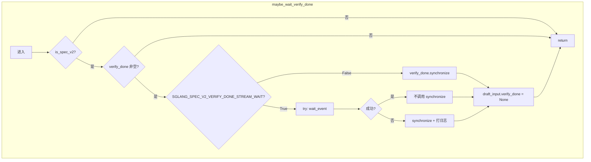
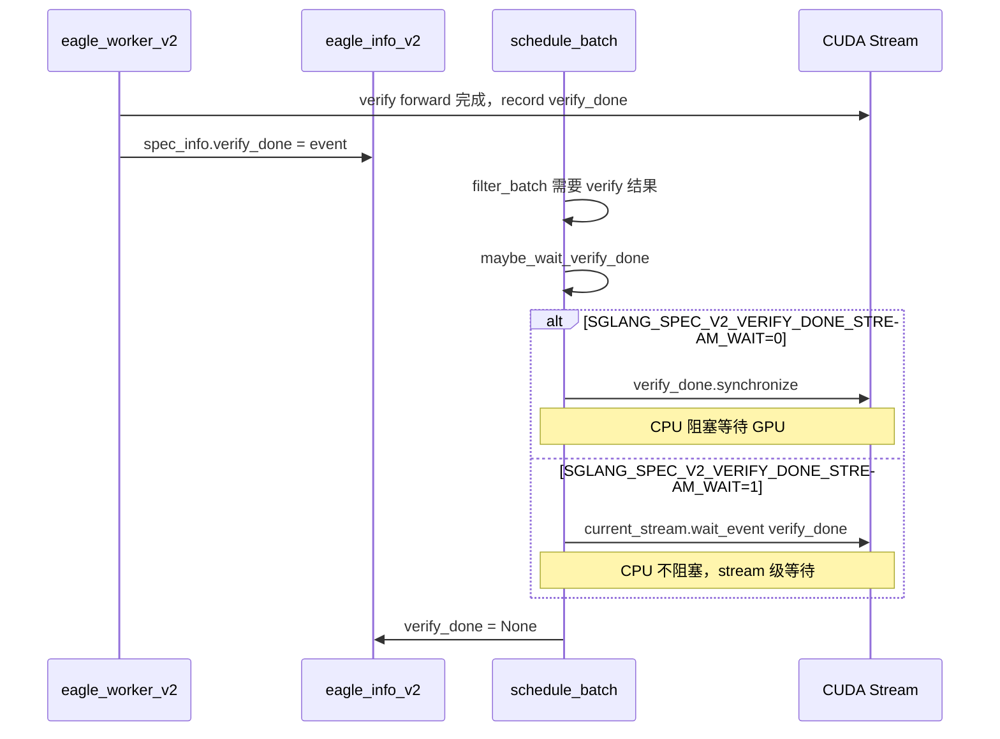

# SpecV2 verify_done.synchronize 可选化

## 1. Motivation

在 SpecV2（SGLang 投机解码与 overlap scheduler 融合模式）下，每次 decode step 都会在 maybe_wait_verify_done() 中调用 verify_done.synchronize()，这是 CPU-GPU 硬同步。overlap 设计的核心目的是让 CPU 与 GPU 并行工作，而 synchronize() 会强制 CPU 等待 GPU 完成 verify，直接抵消了 overlap 的收益。

核心收益：消除 overlap 路径中最大的同步开销。改为 stream-level event wait 可以让 CPU 继续调度下一轮，只在真正需要 CPU 读取 GPU 数据时才同步，显著提升 overlap 性能。

---

## 2. 当前实现与瓶颈

### 当前实现

- 调用点：python/sglang/srt/managers/schedule_batch.py 中 maybe_wait_verify_done() 被 filter_batch() 调用；verify_done 由 eagle_worker_v2.py、multi_layer_eagle_worker_v2.py 在 verify 阶段创建并 record，eagle_info_v2.py 主要消费/使用。
- 逻辑：若 ScheduleBatch.is_spec_v2 且 draft_input.verify_done 非空，则调用 verify_done.synchronize()，然后置 verify_done = None 避免重复等待。
- 瓶颈：每个 decode step 必有一次 CPU 等待 GPU，无法与后续调度重叠，成为 overlap 的天花板。

### 相关文件

| 文件 | 作用 |
|------|------|
| [python/sglang/srt/managers/schedule_batch.py](python/sglang/srt/managers/schedule_batch.py) | `maybe_wait_verify_done()`、`filter_batch()` 调用点 |
| [python/sglang/srt/speculative/eagle_info_v2.py](python/sglang/srt/speculative/eagle_info_v2.py) | `verify_done` 的主要消费/使用 |
| [python/sglang/srt/speculative/eagle_worker_v2.py](python/sglang/srt/speculative/eagle_worker_v2.py) | 单层 EAGLE verify 路径，记录 event |
| [python/sglang/srt/speculative/multi_layer_eagle_worker_v2.py](python/sglang/srt/speculative/multi_layer_eagle_worker_v2.py) | 多层 EAGLE verify 路径，记录 event |
| [python/sglang/srt/environ.py](python/sglang/srt/environ.py) | `SGLANG_SPEC_V2_VERIFY_DONE_STREAM_WAIT` 定义 |

---

## 3. 修改点

**默认行为不变**：未设置 `SGLANG_SPEC_V2_VERIFY_DONE_STREAM_WAIT` 或设为 `False` 时，与修改前完全一致，仍使用 `verify_done.synchronize()`。

### 核心改动

在 `maybe_wait_verify_done()` 中增加分支：

- **默认（`SGLANG_SPEC_V2_VERIFY_DONE_STREAM_WAIT=False`）**：保持原有行为，调用 `verify_done.synchronize()`。
- **开启（`SGLANG_SPEC_V2_VERIFY_DONE_STREAM_WAIT=True`）**：优先调用 `torch.get_device_module(device).current_stream().wait_event(verify_done)`，若失败则回退到 `synchronize()`。

### 代码逻辑（示意）

```python
# schedule_batch.py
if envs.SGLANG_SPEC_V2_VERIFY_DONE_STREAM_WAIT.get():
    try:
        torch.get_device_module(self.device).current_stream().wait_event(verify_done)
    except Exception:
        logger.exception("Failed to wait verify_done on current stream; fall back to synchronize().")
        verify_done.synchronize()
else:
    verify_done.synchronize()
draft_input.verify_done = None  # 消费一次，避免重复等待
```

---

## 4. 环境变量 SGLANG_SPEC_V2_VERIFY_DONE_STREAM_WAIT 说明

| 属性 | 说明 |
|------|------|
| **名称** | `SGLANG_SPEC_V2_VERIFY_DONE_STREAM_WAIT` |
| **类型** | bool（`EnvBool`） |
| **默认值** | `False` |
| **定义位置** | [python/sglang/srt/environ.py](python/sglang/srt/environ.py) |
| **生效条件** | 仅 SpecV2 模式（`is_spec_v2=True`）且 `verify_done` 非空时 |

**取值含义**：

- `0` / `false` / `no`：使用 `synchronize()`，与修改前行为一致，保证最大兼容性与正确性。
- `1` / `true` / `yes`：优先使用 `current_stream().wait_event(verify_done)`，减少 CPU 阻塞，提升 overlap 性能；若 `wait_event` 失败则回退到 `synchronize()`。

---

## 5. 鲁棒性与风险控制

### wait_event 失败回退 synchronize

- **实现**：在 `try/except` 中调用 `wait_event`，任何异常（如 stream 不可用、event 无效）都会捕获并调用 `synchronize()`，同时打日志。
- **目的**：确保在异常环境下仍能正确同步，避免数据竞争与错误输出。

### 避免死锁 / IMA 思路

- **消费一次**：`maybe_wait_verify_done()` 调用后立即执行 `draft_input.verify_done = None`，避免同一 event 被多次 wait 或 synchronize。
- **调用时机**：仅在 `filter_batch()` 内部、需要基于 verify 结果做 batch 过滤时调用，保证依赖关系正确。
- **IMA（Incorrect Memory Access）防护**：`wait_event` 仅使当前 stream 等待 verify 完成，不改变数据可见性语义；若 `wait_event` 失败回退 `synchronize`，行为与原先完全一致，无额外 IMA 风险。

---

## 6. 单测设计与覆盖点

单测文件：[test/registered/scheduler/test_verify_done_optional_wait.py](test/registered/scheduler/test_verify_done_optional_wait.py)

| 用例 | 覆盖点 |
|------|--------|
| `test_synchronize_by_default` | `SGLANG_SPEC_V2_VERIFY_DONE_STREAM_WAIT=False` 时调用 `synchronize()`，不调用 `wait_event`，event 被消费 |
| `test_wait_event_when_enabled` | `SGLANG_SPEC_V2_VERIFY_DONE_STREAM_WAIT=True` 时调用 `wait_event`，不调用 `synchronize` |
| `test_noop_when_event_is_none` | `verify_done=None` 时无需等待，直接返回 |
| `test_wait_event_falls_back_to_synchronize` | `wait_event` 抛异常时回退到 `synchronize()`，并打 ERROR 日志 |
| `test_event_is_consumed_once` | 第二次调用 `maybe_wait_verify_done` 时 `verify_done` 已为 None，不再调用 synchronize |

---

## 7. E2E 方案

### 启动 SpecV2 服务

```bash
# 默认（synchronize 路径）
SGLANG_ENABLE_SPEC_V2=1 python -m sglang.launch_server \
  --model-path <MODEL_PATH> \
  --speculative-draft-model <DRAFT_MODEL_PATH> \
  ...

# stream wait 路径
SGLANG_ENABLE_SPEC_V2=1 SGLANG_SPEC_V2_VERIFY_DONE_STREAM_WAIT=1 python -m sglang.launch_server \
  --model-path <MODEL_PATH> \
  --speculative-draft-model <DRAFT_MODEL_PATH> \
  ...
```

### 直接执行 unittest

```bash
cd /root/code/origin_sglang/current/spec_verify_done/test/registered && SGLANG_SPEC_V2_VERIFY_DONE_STREAM_WAIT=0 python -m unittest spec.eagle.test_eagle_infer_beta.TestEagleServerBase.test_gsm8k
cd /root/code/origin_sglang/current/spec_verify_done/test/registered && SGLANG_SPEC_V2_VERIFY_DONE_STREAM_WAIT=1 python -m unittest spec.eagle.test_eagle_infer_beta.TestEagleServerBase.test_gsm8k
```

### 简单生成测试

```bash
curl -X POST http://localhost:30000/v1/completions \
  -H "Content-Type: application/json" \
  -d '{"model": "default", "prompt": "Hello", "max_tokens": 32}'
```

### 批量流式测试

```bash
for i in {1..10}; do
  curl -N -X POST http://localhost:30000/v1/completions \
    -H "Content-Type: application/json" \
    -d "{\"model\": \"default\", \"prompt\": \"Test $i\", \"max_tokens\": 64, \"stream\": true}" &
done
wait
```

---

## 8. Benchmark 方案

### 环境变量组合

| 组合 | SGLANG_ENABLE_SPEC_V2 | SGLANG_SPEC_V2_VERIFY_DONE_STREAM_WAIT | SGLANG_RECORD_STEP_TIME | 说明 |
|------|------------------------|----------------------------------------|--------------------------|------|
| A | 1 | 0 | 1 | 基准：synchronize 路径 + 记录 step 时间 |
| B | 1 | 1 | 1 | 优化：stream wait 路径 + 记录 step 时间 |

### 可复制命令

```bash
# 1. 启动服务（基准）
SGLANG_ENABLE_SPEC_V2=1 SGLANG_SPEC_V2_VERIFY_DONE_STREAM_WAIT=0 SGLANG_RECORD_STEP_TIME=1 \
  python -m sglang.launch_server --model-path <TARGET> --speculative-draft-model <DRAFT> ...

# 2. 启动服务（优化）
SGLANG_ENABLE_SPEC_V2=1 SGLANG_SPEC_V2_VERIFY_DONE_STREAM_WAIT=1 SGLANG_RECORD_STEP_TIME=1 \
  python -m sglang.launch_server --model-path <TARGET> --speculative-draft-model <DRAFT> ...
```

### 关注指标

- **吞吐**：tokens/s
- **首 token 延迟**：TTFT
- **每 step 时间**：`SGLANG_RECORD_STEP_TIME=1` 时日志中的 step 统计
- **compare A vs B**：验证 stream wait 是否带来 overlap 收益

---

## 9. 回滚方案

### 代码回滚

- 恢复 `maybe_wait_verify_done()` 为仅调用 `synchronize()` 的版本，删除 `SGLANG_SPEC_V2_VERIFY_DONE_STREAM_WAIT` 分支。
- 从 `python/sglang/srt/environ.py` 中移除或注释 `SGLANG_SPEC_V2_VERIFY_DONE_STREAM_WAIT` 定义。

### 运行时回滚

- 将 `SGLANG_SPEC_V2_VERIFY_DONE_STREAM_WAIT` 设为 `0` 或 `false`，无需改代码即可切回 synchronize 路径。
- 若在生产中发现 stream wait 导致异常，可立即通过环境变量回滚。

---

## 10. 流程图



---

## 11. 数据流



